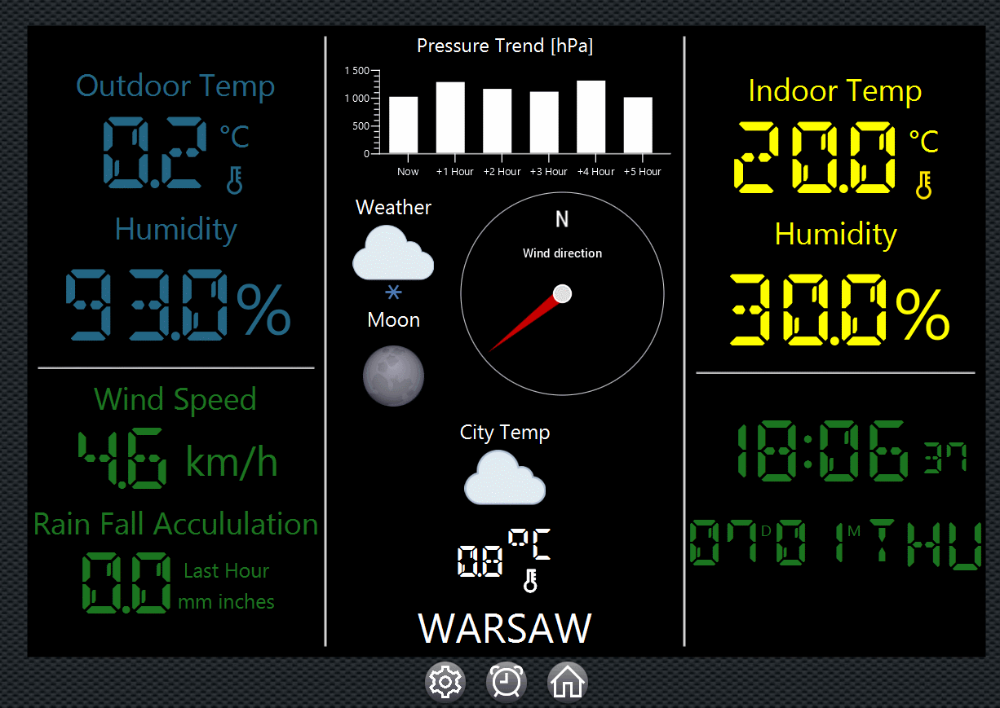

### WatherStation

- Używana dodatkowa biblioteka:  [Medusa-11.5](https://github.com/HanSolo/Medusa "Heading link") , do doinstalowania osobno w projekcie.
- W razie problemów przu uruchamianiu projektu należy dodać w VM options : --add-opens WeatherStation/app.api.data="com.google.gson"

